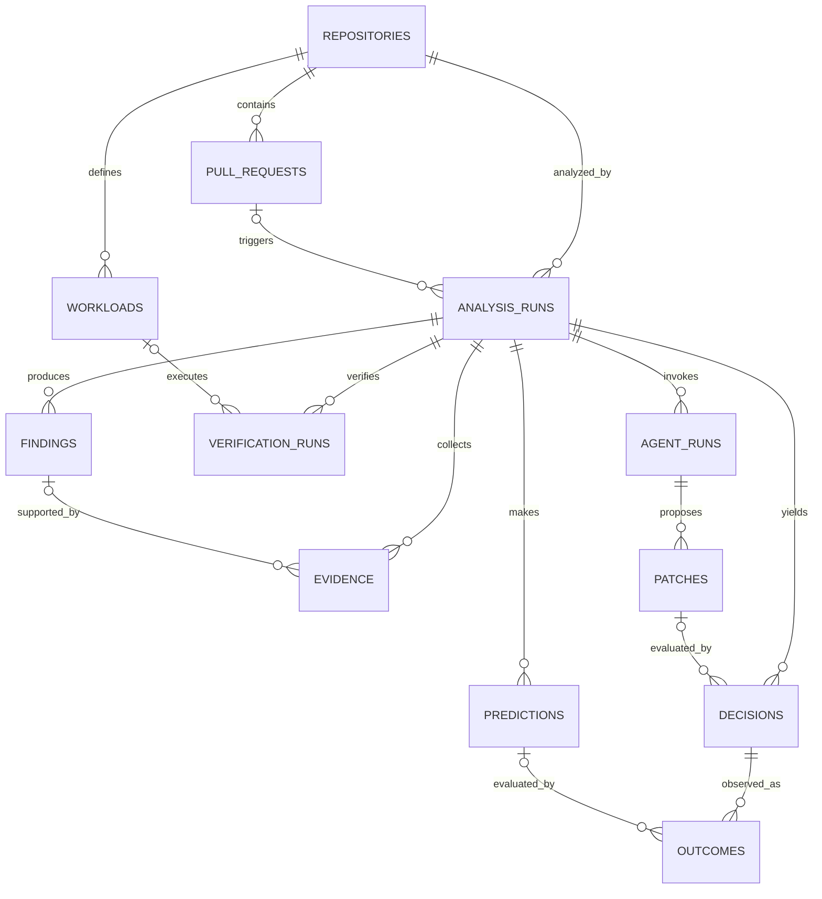

# PostgreSQL Schema Plan

This schema supports Lou's local hackathon workflow while leaving clean extension points for repository graphs and long-term learning. PostgreSQL is the system of record; source code, full logs, profiles, and large analyzer outputs remain filesystem artifacts referenced by URI and hash.

## Design Principles

- Use UUIDs for records that cross process boundaries.
- Identify every analysis by repository plus immutable commit SHAs.
- Store evidence separately from findings and decisions.
- Use relational columns for identifiers and lifecycle fields that must be queried.
- Use `JSONB` for tool-specific payloads and features that will evolve during the hackathon.
- Preserve prediction values before attaching observed outcomes.
- Never overwrite completed verification evidence; create a new attempt.
- Store artifact hashes so local files can be checked for integrity.

## Persistence Tooling

Use a fully local, open-source stack:

```text
PostgreSQL container
SQLAlchemy 2.x models and repositories
Alembic migrations
psycopg 3 driver
Pydantic API contracts
pytest integration tests against PostgreSQL
```

Keep SQLAlchemy models inside `backend/lou/persistence`; do not return them directly from FastAPI routes. Pydantic contracts belong at the application boundary, and domain services should depend on repository interfaces rather than sessions.

Use one synchronous database access style for the hackathon unless concurrent workload measurements prove that async access is necessary. Mixing synchronous and asynchronous sessions during a short build adds failure modes without improving the core demo.

## MVP Relationship Model



## Core Tables

### `repositories`

One registered local or hosted repository.

Important fields:

```text
id
provider and provider_repository_id
owner and name
local_path or clone_url
default_branch
created_at and updated_at
```

For local mode, `provider = 'local'` and `local_path` is populated. Hosted credentials are never stored in this table.

### `pull_requests`

Optional hosted pull-request metadata. Local CLI runs can leave `pull_request_id` null on the analysis run.

### `analysis_runs`

The aggregate root for a single baseline-versus-candidate analysis.

It contains immutable input identity, lifecycle status, trigger type, configuration snapshot, toolchain revision, and failure information. Child records hold findings, evidence, predictions, verification, agent attempts, and decisions.

### `workloads`

Metadata for checked-in pytest, k6, or other verification scenarios. The executable definition remains in the repository; PostgreSQL stores its path, selector metadata, and version hash.

### `findings`

A normalized conclusion such as a performance regression or static-analysis issue. `fingerprint` makes repeated analyzer output deduplicable within a run.

### `evidence`

An immutable observation supporting a finding or decision. Examples include test output, a k6 summary, a metric sample set, a Semgrep result, or graph context.

The database stores a compact summary. `artifact_uri` points to the complete local artifact and `artifact_sha256` verifies it.

### `predictions`

What Lou believed before verification: affected tests, affected endpoints, expected performance direction, debt growth, or remediation risk. Features and model or rule revisions make the prediction reproducible.

### `verification_runs`

One execution attempt for `baseline`, `candidate`, or `fix`. Environment, resource limits, aggregate metrics, and raw artifact references are retained per attempt.

### `agent_runs` and `patches`

An agent run records role, model adapter, bounded input summary, usage, and outcome. A patch is a separate immutable artifact so several candidate patches can be compared without overwriting one another.

### `decisions`

The evidence-backed action selected by Lou. It stores debt risk, remediation risk, confidence, autonomy level, policy revision, features, and human-readable rationale.

### `outcomes`

Observed results associated with a decision and optionally a prediction. Immediate verification outcomes and later production outcomes use the same structure but different observation windows.

## Draft MVP DDL

```sql
CREATE EXTENSION IF NOT EXISTS pgcrypto;

CREATE TABLE repositories (
    id UUID PRIMARY KEY DEFAULT gen_random_uuid(),
    provider TEXT NOT NULL CHECK (provider IN ('local', 'github')),
    provider_repository_id TEXT,
    owner_name TEXT,
    repository_name TEXT NOT NULL,
    local_path TEXT,
    clone_url TEXT,
    default_branch TEXT NOT NULL DEFAULT 'main',
    created_at TIMESTAMPTZ NOT NULL DEFAULT now(),
    updated_at TIMESTAMPTZ NOT NULL DEFAULT now(),
    CHECK (local_path IS NOT NULL OR clone_url IS NOT NULL),
    UNIQUE (provider, provider_repository_id)
);

CREATE TABLE pull_requests (
    id UUID PRIMARY KEY DEFAULT gen_random_uuid(),
    repository_id UUID NOT NULL REFERENCES repositories(id) ON DELETE CASCADE,
    provider_number INTEGER NOT NULL,
    title TEXT,
    state TEXT NOT NULL DEFAULT 'open'
        CHECK (state IN ('open', 'closed', 'merged')),
    base_commit_sha TEXT NOT NULL,
    head_commit_sha TEXT NOT NULL,
    author_login TEXT,
    opened_at TIMESTAMPTZ,
    closed_at TIMESTAMPTZ,
    created_at TIMESTAMPTZ NOT NULL DEFAULT now(),
    updated_at TIMESTAMPTZ NOT NULL DEFAULT now(),
    UNIQUE (repository_id, provider_number)
);

CREATE TABLE analysis_runs (
    id UUID PRIMARY KEY DEFAULT gen_random_uuid(),
    repository_id UUID NOT NULL REFERENCES repositories(id) ON DELETE CASCADE,
    pull_request_id UUID REFERENCES pull_requests(id) ON DELETE SET NULL,
    trigger_type TEXT NOT NULL
        CHECK (trigger_type IN ('cli', 'api', 'github_webhook', 'fixture')),
    status TEXT NOT NULL DEFAULT 'queued'
        CHECK (status IN (
            'queued', 'running', 'succeeded', 'failed',
            'cancelled', 'inconclusive'
        )),
    base_commit_sha TEXT NOT NULL,
    candidate_commit_sha TEXT NOT NULL,
    fix_commit_sha TEXT,
    deduplication_key TEXT NOT NULL UNIQUE,
    configuration JSONB NOT NULL DEFAULT '{}'::jsonb,
    toolchain_revision TEXT NOT NULL,
    policy_revision TEXT NOT NULL,
    error_code TEXT,
    error_message TEXT,
    started_at TIMESTAMPTZ,
    completed_at TIMESTAMPTZ,
    created_at TIMESTAMPTZ NOT NULL DEFAULT now(),
    CHECK (base_commit_sha <> candidate_commit_sha)
);

CREATE TABLE workloads (
    id UUID PRIMARY KEY DEFAULT gen_random_uuid(),
    repository_id UUID NOT NULL REFERENCES repositories(id) ON DELETE CASCADE,
    name TEXT NOT NULL,
    workload_type TEXT NOT NULL
        CHECK (workload_type IN ('pytest', 'k6', 'semgrep', 'custom')),
    definition_path TEXT NOT NULL,
    definition_sha256 TEXT NOT NULL,
    selectors JSONB NOT NULL DEFAULT '{}'::jsonb,
    enabled BOOLEAN NOT NULL DEFAULT true,
    created_at TIMESTAMPTZ NOT NULL DEFAULT now(),
    updated_at TIMESTAMPTZ NOT NULL DEFAULT now(),
    UNIQUE (repository_id, name)
);

CREATE TABLE findings (
    id UUID PRIMARY KEY DEFAULT gen_random_uuid(),
    analysis_run_id UUID NOT NULL REFERENCES analysis_runs(id) ON DELETE CASCADE,
    fingerprint TEXT NOT NULL,
    source TEXT NOT NULL,
    rule_id TEXT,
    category TEXT NOT NULL,
    severity TEXT NOT NULL
        CHECK (severity IN ('info', 'low', 'medium', 'high', 'critical')),
    confidence NUMERIC(5,4)
        CHECK (confidence >= 0 AND confidence <= 1),
    phase TEXT NOT NULL
        CHECK (phase IN ('baseline', 'candidate', 'fix')),
    file_path TEXT,
    symbol_key TEXT,
    start_line INTEGER CHECK (start_line IS NULL OR start_line > 0),
    end_line INTEGER CHECK (end_line IS NULL OR end_line > 0),
    title TEXT NOT NULL,
    message TEXT NOT NULL,
    details JSONB NOT NULL DEFAULT '{}'::jsonb,
    created_at TIMESTAMPTZ NOT NULL DEFAULT now(),
    UNIQUE (analysis_run_id, phase, fingerprint)
);

CREATE TABLE evidence (
    id UUID PRIMARY KEY DEFAULT gen_random_uuid(),
    analysis_run_id UUID NOT NULL REFERENCES analysis_runs(id) ON DELETE CASCADE,
    finding_id UUID REFERENCES findings(id) ON DELETE SET NULL,
    phase TEXT NOT NULL
        CHECK (phase IN ('baseline', 'candidate', 'fix', 'comparison')),
    kind TEXT NOT NULL,
    source TEXT NOT NULL,
    schema_version TEXT NOT NULL DEFAULT '1',
    summary JSONB NOT NULL DEFAULT '{}'::jsonb,
    artifact_uri TEXT,
    artifact_sha256 TEXT,
    collected_at TIMESTAMPTZ NOT NULL DEFAULT now(),
    CHECK (
        (artifact_uri IS NULL AND artifact_sha256 IS NULL)
        OR (artifact_uri IS NOT NULL AND artifact_sha256 IS NOT NULL)
    )
);

CREATE TABLE predictions (
    id UUID PRIMARY KEY DEFAULT gen_random_uuid(),
    analysis_run_id UUID NOT NULL REFERENCES analysis_runs(id) ON DELETE CASCADE,
    prediction_type TEXT NOT NULL
        CHECK (prediction_type IN (
            'impact', 'performance', 'debt_interest', 'remediation_risk'
        )),
    subject_type TEXT NOT NULL,
    subject_key TEXT NOT NULL,
    predicted_value JSONB NOT NULL,
    confidence NUMERIC(5,4) NOT NULL
        CHECK (confidence >= 0 AND confidence <= 1),
    features JSONB NOT NULL DEFAULT '{}'::jsonb,
    predictor_name TEXT NOT NULL,
    predictor_revision TEXT NOT NULL,
    created_at TIMESTAMPTZ NOT NULL DEFAULT now()
);

CREATE TABLE verification_runs (
    id UUID PRIMARY KEY DEFAULT gen_random_uuid(),
    analysis_run_id UUID NOT NULL REFERENCES analysis_runs(id) ON DELETE CASCADE,
    workload_id UUID REFERENCES workloads(id) ON DELETE SET NULL,
    phase TEXT NOT NULL
        CHECK (phase IN ('baseline', 'candidate', 'fix')),
    attempt INTEGER NOT NULL DEFAULT 1 CHECK (attempt > 0),
    status TEXT NOT NULL
        CHECK (status IN ('queued', 'running', 'passed', 'failed', 'inconclusive')),
    commit_sha TEXT NOT NULL,
    environment_image_digest TEXT,
    resource_limits JSONB NOT NULL DEFAULT '{}'::jsonb,
    aggregate_metrics JSONB NOT NULL DEFAULT '{}'::jsonb,
    artifact_uri TEXT,
    artifact_sha256 TEXT,
    started_at TIMESTAMPTZ,
    completed_at TIMESTAMPTZ,
    created_at TIMESTAMPTZ NOT NULL DEFAULT now(),
    UNIQUE (analysis_run_id, workload_id, phase, attempt)
);

CREATE TABLE agent_runs (
    id UUID PRIMARY KEY DEFAULT gen_random_uuid(),
    analysis_run_id UUID NOT NULL REFERENCES analysis_runs(id) ON DELETE CASCADE,
    role TEXT NOT NULL
        CHECK (role IN ('diagnose', 'plan', 'patch', 'test', 'review')),
    attempt INTEGER NOT NULL DEFAULT 1 CHECK (attempt > 0),
    status TEXT NOT NULL
        CHECK (status IN ('queued', 'running', 'succeeded', 'failed', 'abandoned')),
    model_provider TEXT NOT NULL,
    model_name TEXT NOT NULL,
    prompt_revision TEXT NOT NULL,
    input_summary JSONB NOT NULL DEFAULT '{}'::jsonb,
    output_summary JSONB NOT NULL DEFAULT '{}'::jsonb,
    input_tokens INTEGER CHECK (input_tokens IS NULL OR input_tokens >= 0),
    output_tokens INTEGER CHECK (output_tokens IS NULL OR output_tokens >= 0),
    estimated_cost_usd NUMERIC(12,6)
        CHECK (estimated_cost_usd IS NULL OR estimated_cost_usd >= 0),
    started_at TIMESTAMPTZ,
    completed_at TIMESTAMPTZ,
    created_at TIMESTAMPTZ NOT NULL DEFAULT now(),
    UNIQUE (analysis_run_id, role, attempt)
);

CREATE TABLE patches (
    id UUID PRIMARY KEY DEFAULT gen_random_uuid(),
    analysis_run_id UUID NOT NULL REFERENCES analysis_runs(id) ON DELETE CASCADE,
    agent_run_id UUID REFERENCES agent_runs(id) ON DELETE SET NULL,
    base_commit_sha TEXT NOT NULL,
    patch_sha256 TEXT NOT NULL,
    artifact_uri TEXT NOT NULL,
    status TEXT NOT NULL DEFAULT 'proposed'
        CHECK (status IN ('proposed', 'verifying', 'verified', 'rejected', 'published')),
    files_changed INTEGER NOT NULL CHECK (files_changed >= 0),
    lines_added INTEGER NOT NULL CHECK (lines_added >= 0),
    lines_deleted INTEGER NOT NULL CHECK (lines_deleted >= 0),
    created_at TIMESTAMPTZ NOT NULL DEFAULT now(),
    UNIQUE (analysis_run_id, patch_sha256)
);

CREATE TABLE decisions (
    id UUID PRIMARY KEY DEFAULT gen_random_uuid(),
    analysis_run_id UUID NOT NULL REFERENCES analysis_runs(id) ON DELETE CASCADE,
    patch_id UUID REFERENCES patches(id) ON DELETE SET NULL,
    debt_risk NUMERIC(5,4) NOT NULL CHECK (debt_risk >= 0 AND debt_risk <= 1),
    remediation_risk NUMERIC(5,4)
        CHECK (remediation_risk >= 0 AND remediation_risk <= 1),
    confidence NUMERIC(5,4) NOT NULL CHECK (confidence >= 0 AND confidence <= 1),
    autonomy_level INTEGER NOT NULL CHECK (autonomy_level BETWEEN 0 AND 3),
    selected_action TEXT NOT NULL
        CHECK (selected_action IN ('report', 'recommend', 'generate_patch', 'open_pr')),
    policy_revision TEXT NOT NULL,
    features JSONB NOT NULL DEFAULT '{}'::jsonb,
    rationale JSONB NOT NULL DEFAULT '{}'::jsonb,
    created_at TIMESTAMPTZ NOT NULL DEFAULT now()
);

CREATE TABLE outcomes (
    id UUID PRIMARY KEY DEFAULT gen_random_uuid(),
    analysis_run_id UUID NOT NULL REFERENCES analysis_runs(id) ON DELETE CASCADE,
    decision_id UUID REFERENCES decisions(id) ON DELETE SET NULL,
    prediction_id UUID REFERENCES predictions(id) ON DELETE SET NULL,
    outcome_type TEXT NOT NULL,
    observation_window TEXT NOT NULL,
    status TEXT NOT NULL
        CHECK (status IN ('not_yet_observed', 'observed', 'unknown', 'not_applicable')),
    expected_value JSONB,
    observed_value JSONB,
    evaluation JSONB NOT NULL DEFAULT '{}'::jsonb,
    observed_at TIMESTAMPTZ,
    created_at TIMESTAMPTZ NOT NULL DEFAULT now(),
    CHECK (
        status <> 'observed'
        OR (observed_value IS NOT NULL AND observed_at IS NOT NULL)
    )
);

CREATE INDEX analysis_runs_repository_created_idx
    ON analysis_runs (repository_id, created_at DESC);

CREATE INDEX analysis_runs_status_idx
    ON analysis_runs (status)
    WHERE status IN ('queued', 'running');

CREATE INDEX findings_run_severity_idx
    ON findings (analysis_run_id, severity);

CREATE INDEX findings_symbol_idx
    ON findings (symbol_key)
    WHERE symbol_key IS NOT NULL;

CREATE INDEX evidence_run_phase_kind_idx
    ON evidence (analysis_run_id, phase, kind);

CREATE INDEX predictions_run_type_idx
    ON predictions (analysis_run_id, prediction_type);

CREATE INDEX verification_runs_run_phase_idx
    ON verification_runs (analysis_run_id, phase);

CREATE INDEX decisions_run_created_idx
    ON decisions (analysis_run_id, created_at DESC);

CREATE INDEX outcomes_pending_idx
    ON outcomes (status, observation_window)
    WHERE status = 'not_yet_observed';
```

## Graph Persistence: Second Migration

For the hackathon, NetworkX may be rebuilt from the repository and cached as a hashed JSON artifact. Add relational graph persistence only if the API or UI needs graph queries across runs.

```sql
CREATE TABLE graph_snapshots (
    id UUID PRIMARY KEY DEFAULT gen_random_uuid(),
    repository_id UUID NOT NULL REFERENCES repositories(id) ON DELETE CASCADE,
    commit_sha TEXT NOT NULL,
    extractor_name TEXT NOT NULL,
    extractor_revision TEXT NOT NULL,
    artifact_uri TEXT,
    artifact_sha256 TEXT,
    created_at TIMESTAMPTZ NOT NULL DEFAULT now(),
    UNIQUE (repository_id, commit_sha, extractor_name, extractor_revision)
);

CREATE TABLE graph_nodes (
    id UUID PRIMARY KEY DEFAULT gen_random_uuid(),
    graph_snapshot_id UUID NOT NULL REFERENCES graph_snapshots(id) ON DELETE CASCADE,
    node_type TEXT NOT NULL,
    node_key TEXT NOT NULL,
    display_name TEXT NOT NULL,
    file_path TEXT,
    symbol_range JSONB,
    attributes JSONB NOT NULL DEFAULT '{}'::jsonb,
    UNIQUE (graph_snapshot_id, node_type, node_key)
);

CREATE TABLE graph_edges (
    id UUID PRIMARY KEY DEFAULT gen_random_uuid(),
    graph_snapshot_id UUID NOT NULL REFERENCES graph_snapshots(id) ON DELETE CASCADE,
    source_node_id UUID NOT NULL REFERENCES graph_nodes(id) ON DELETE CASCADE,
    target_node_id UUID NOT NULL REFERENCES graph_nodes(id) ON DELETE CASCADE,
    edge_type TEXT NOT NULL,
    confidence NUMERIC(5,4) NOT NULL DEFAULT 1
        CHECK (confidence >= 0 AND confidence <= 1),
    attributes JSONB NOT NULL DEFAULT '{}'::jsonb,
    CHECK (source_node_id <> target_node_id),
    UNIQUE (graph_snapshot_id, source_node_id, target_node_id, edge_type)
);

CREATE INDEX graph_nodes_snapshot_type_idx
    ON graph_nodes (graph_snapshot_id, node_type);

CREATE INDEX graph_edges_source_type_idx
    ON graph_edges (source_node_id, edge_type);

CREATE INDEX graph_edges_target_type_idx
    ON graph_edges (target_node_id, edge_type);
```

## Write Lifecycle

```text
1. Upsert repository and optional pull request.
2. Insert analysis run with immutable SHAs and configuration.
3. Insert predictions before verification starts.
4. Insert one verification row per phase, workload, and attempt.
5. Insert normalized findings and immutable evidence references.
6. Insert agent attempt and proposed patch.
7. Verify the patch and insert a new decision.
8. Insert immediate outcomes; create pending rows for later observation windows.
9. Mark the analysis run succeeded, failed, cancelled, or inconclusive.
```

Status transitions should happen through persistence-layer methods that validate the current state. Do not let route handlers or LangGraph nodes issue unrelated SQL updates directly.

## Transaction Boundaries

- Creating an analysis run and its deduplication key is one transaction.
- Claiming a queued run uses `SELECT ... FOR UPDATE SKIP LOCKED` if workers are introduced.
- Completing a verification attempt and attaching its evidence is one transaction.
- Publishing a patch does not mutate the decision; it changes patch status and records a publication outcome.
- Artifact files should be written and hashed before their database record is committed.

## Retention

Keep relational summaries for the duration of the hackathon. Large local artifacts can use a configurable retention period. Deleting an analysis run cascades through its derived records, but artifact cleanup must be handled separately from the database transaction.

Never persist repository credentials, raw environment variables, unredacted secrets, or unrestricted agent prompts. Store prompt and tool revisions plus bounded summaries sufficient for reproducibility.

## Decisions to Lock Before Migration One

The team should resolve these implementation details before turning the draft into Alembic migrations:

1. PostgreSQL major version used by every teammate and CI.
2. The local artifact root and URI convention, such as `artifact://runs/{run_id}/...`.
3. Whether local repositories are registered by canonical absolute path or a generated workspace identity.
4. The exact run-status transition table and which service owns each transition.
5. Whether `pull_requests` ships in migration one or waits for GitHub integration.
6. Maximum inline `JSONB` payload size before data must move to an artifact.
7. Retention behavior for local artifacts when an analysis run is deleted.

Cross-record invariants also need one clear owner. For example, a decision, patch, and agent run linked together must all belong to the same analysis run. The hackathon persistence service may enforce this transactionally; a later schema can add composite foreign keys if multiple services begin writing directly.

## Recommended Implementation Order

1. `repositories`
2. `analysis_runs`
3. `workloads`
4. `verification_runs`
5. `findings` and `evidence`
6. `predictions`
7. `agent_runs` and `patches`
8. `decisions` and `outcomes`
9. optional pull-request metadata
10. optional graph persistence

The first migration does not need every table at once. The earliest vertical slice only requires repositories, analysis runs, workloads, verification runs, findings, and evidence. Add prediction, agent, and decision tables as those pipeline stages become real.
