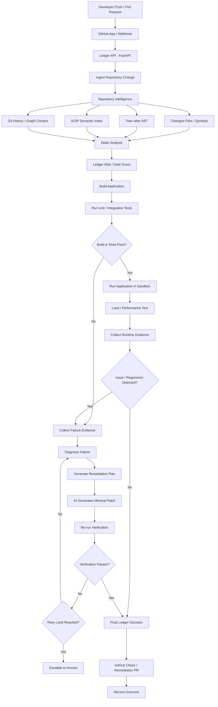

# End-to-End Ledger Workflow


```mermaid
flowchart TD
    A[Developer Push / Pull Request] --> B[GitHub App / Webhook]

    B --> C[Ledger API - FastAPI]
    C --> D[Ingest Repository Change]

    D --> E[Repository Intelligence]
    E --> E1[Changed Files / Symbols]
    E --> E2[Tree-sitter AST]
    E --> E3[SCIP Semantic Index]
    E --> E4[Git History / Graph Context]

    E1 --> F[Static Analysis]
    E2 --> F
    E3 --> F
    E4 --> F

    F --> G[Ledger Risk / Debt Score]
    G --> H[Build Application]
    H --> I[Run Unit / Integration Tests]

    I --> J{Build & Tests Pass?}

    J -- No --> K[Collect Failure Evidence]
    J -- Yes --> L[Run Application in Sandbox]

    L --> M[Load / Performance Test]
    M --> N[Collect Runtime Evidence]

    N --> O{Issue / Regression Detected?}

    O -- No --> P[Final Ledger Decision]
    O -- Yes --> K

    K --> Q[Diagnose Failure]
    Q --> R[Generate Remediation Plan]
    R --> S[AI Generates Minimal Patch]

    S --> T[Re-run Verification]
    T --> U{Verification Passes?}

    U -- No --> V{Retry Limit Reached?}
    V -- No --> Q
    V -- Yes --> W[Escalate to Human]

    U -- Yes --> P

    P --> X[GitHub Check / Remediation PR]
    X --> Y[Record Outcome]
```

## Purpose

This is the primary Ledger workflow:

```text
Inspect
→ Score
→ Execute
→ Stress
→ Diagnose
→ Repair
→ Verify
→ Record
```
