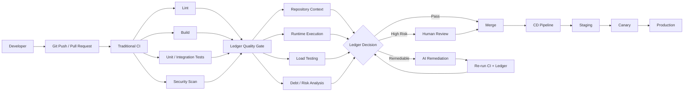

# CI/CD Integration Workflow

```mermaid
flowchart LR
    A[Developer] --> B[Git Push / Pull Request]

    B --> C[Traditional CI]

    C --> C1[Lint]
    C --> C2[Build]
    C --> C3[Unit / Integration Tests]
    C --> C4[Security Scan]

    C1 --> D[Ledger Quality Gate]
    C2 --> D
    C3 --> D
    C4 --> D

    D --> D1[Repository Context]
    D --> D2[Runtime Execution]
    D --> D3[Load Testing]
    D --> D4[Debt / Risk Analysis]

    D1 --> E{Ledger Decision}
    D2 --> E
    D3 --> E
    D4 --> E

    E -->|Pass| F[Merge]
    E -->|Remediable| G[AI Remediation]
    E -->|High Risk| H[Human Review]

    G --> I[Re-run CI + Ledger]
    I --> E

    H --> F
    F --> J[CD Pipeline]
    J --> K[Staging]
    K --> L[Canary]
    L --> M[Production]
```

## Ledger's Role

Ledger acts as an additional quality and risk layer between ordinary CI checks
and the final merge/deployment decision.
