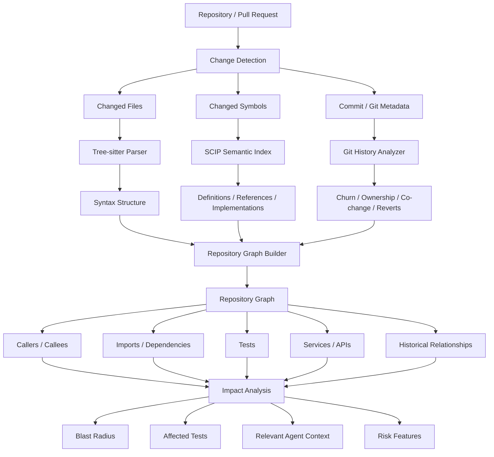

# Repository Intelligence Workflow



## Purpose

The repository intelligence layer answers:

```text
What changed?
What depends on it?
What tests are relevant?
What is the likely blast radius?
What context should the AI agent receive?
```
