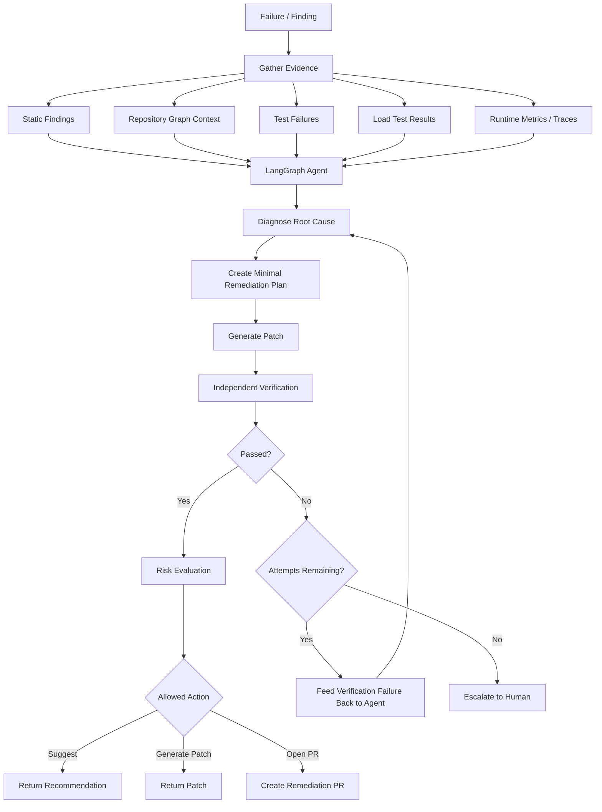

# AI Remediation Workflow



## Agent Design Rule

The agent:

```text
diagnoses
plans
proposes
patches
```

The verifier:

```text
builds
tests
measures
decides whether evidence improved
```

The agent should never be its own final judge.
