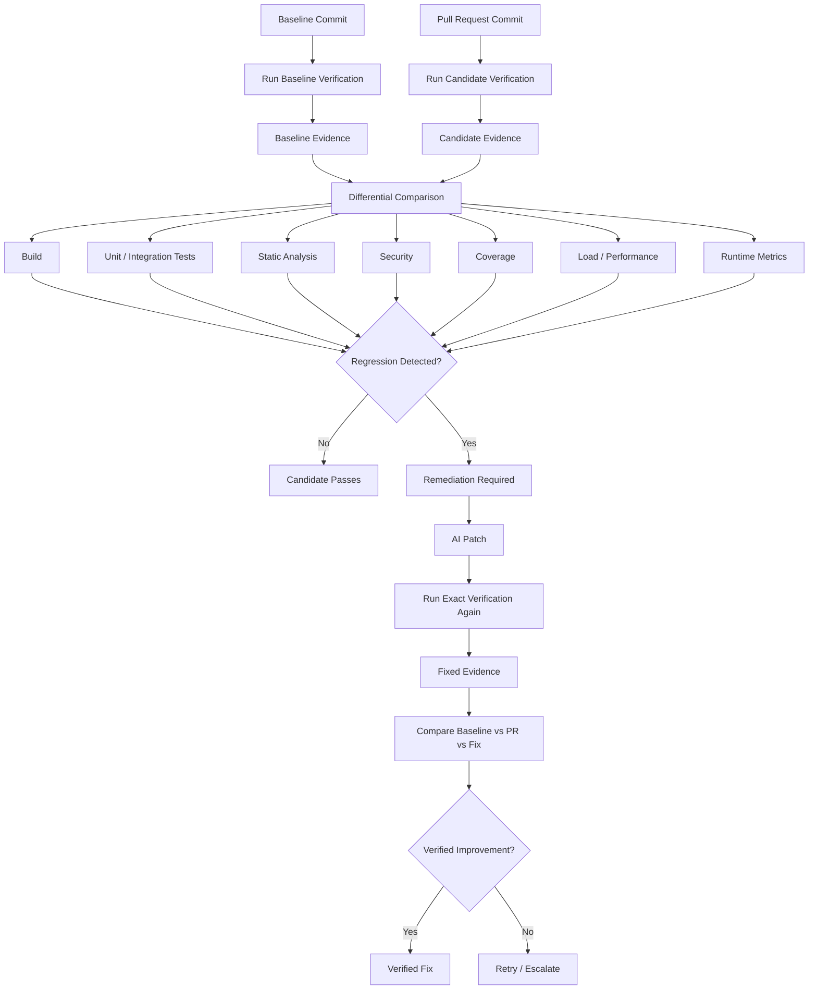

# Verification Workflow



## Example Comparison

```text
                BASE       PR       FIX

Unit tests      818        818      821
Coverage        81%        81%      84%
p95             182ms      420ms    191ms
Error rate      0.1%       4.2%     0.2%
CPU             42%        67%      45%
Risk score      32         76       29
```

The core principle is:

> The exact workload that exposed the problem should be rerun after remediation.
