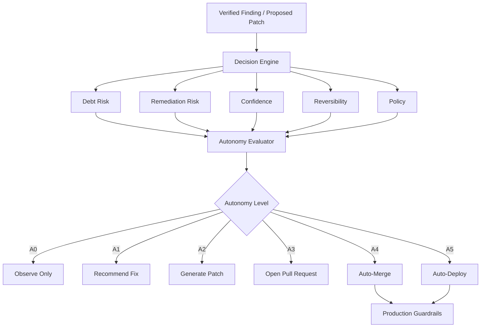

# Risk & Autonomy Decision Workflow



## Suggested Autonomy Levels

```text
A0  Observe only
A1  Recommend
A2  Generate patch
A3  Open PR
A4  Auto-merge
A5  Auto-deploy
```

For the MVP, Lou should stop at:

```text
A3 — Open Pull Request
```

Human review remains the merge authority.
