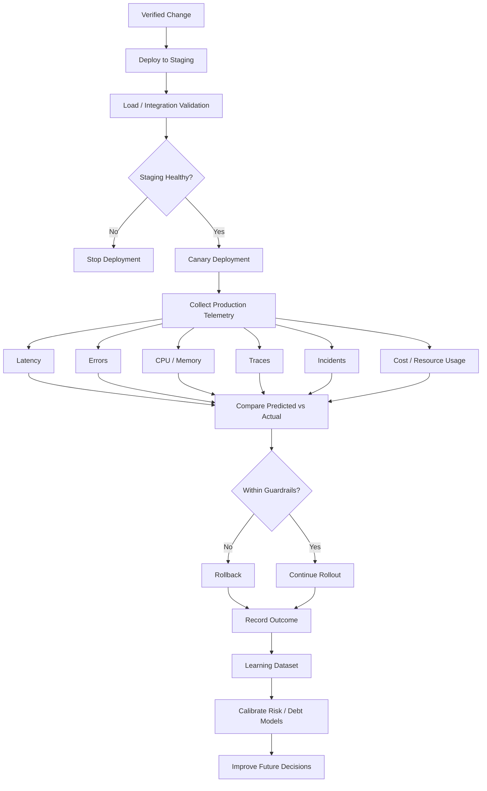

# Production Feedback & Learning Workflow


```mermaid
flowchart TD
    A[Verified Change] --> B[Deploy to Staging]
    B --> C[Load / Integration Validation]

    C --> D{Staging Healthy?}

    D -- No --> E[Stop Deployment]
    D -- Yes --> F[Canary Deployment]

    F --> G[Collect Production Telemetry]

    G --> G1[Latency]
    G --> G2[Errors]
    G --> G3[CPU / Memory]
    G --> G4[Traces]
    G --> G5[Incidents]
    G --> G6[Cost / Resource Usage]

    G1 --> H[Compare Predicted vs Actual]
    G2 --> H
    G3 --> H
    G4 --> H
    G5 --> H
    G6 --> H

    H --> I{Within Guardrails?}

    I -- No --> J[Rollback]
    I -- Yes --> K[Continue Rollout]

    J --> L[Record Outcome]
    K --> L

    L --> M[Learning Dataset]
    M --> N[Calibrate Risk / Debt Models]
    N --> O[Improve Future Decisions]
```

## Learning Loop

```text
Predict
  ↓
Act
  ↓
Observe
  ↓
Compare
  ↓
Learn
  ↺
```

This is a future-stage workflow, not required for the initial MVP.
