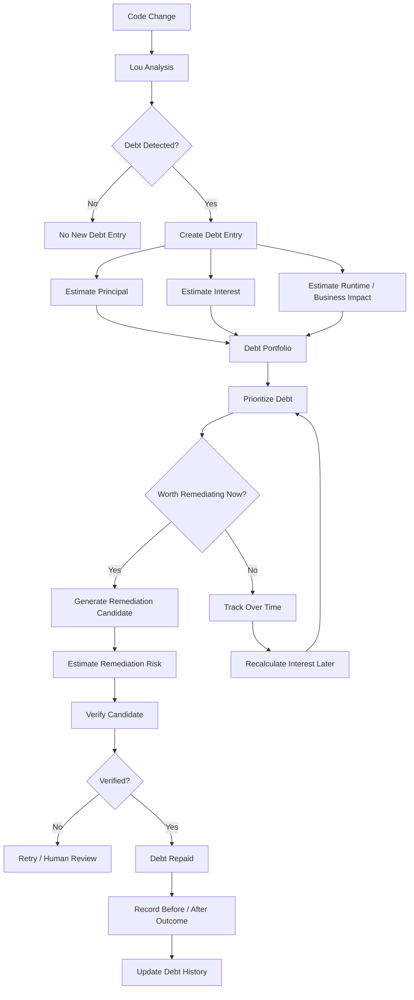

# Technical Debt Lifecycle



## Lou Model

```text
Principal
=
Cost to fix today

Interest
=
Cost created by leaving the issue unresolved
```

For V1, use normalized debt points or engineering-time estimates rather than
pretending dollar estimates are exact.
